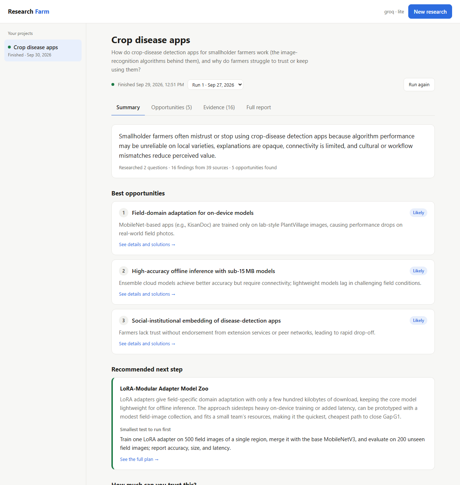
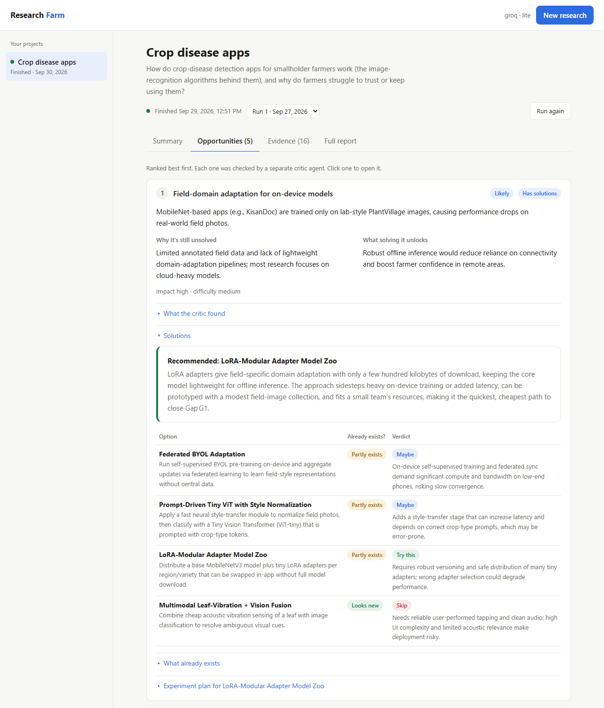
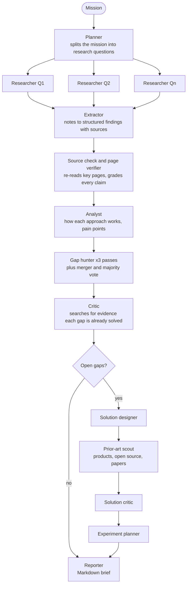
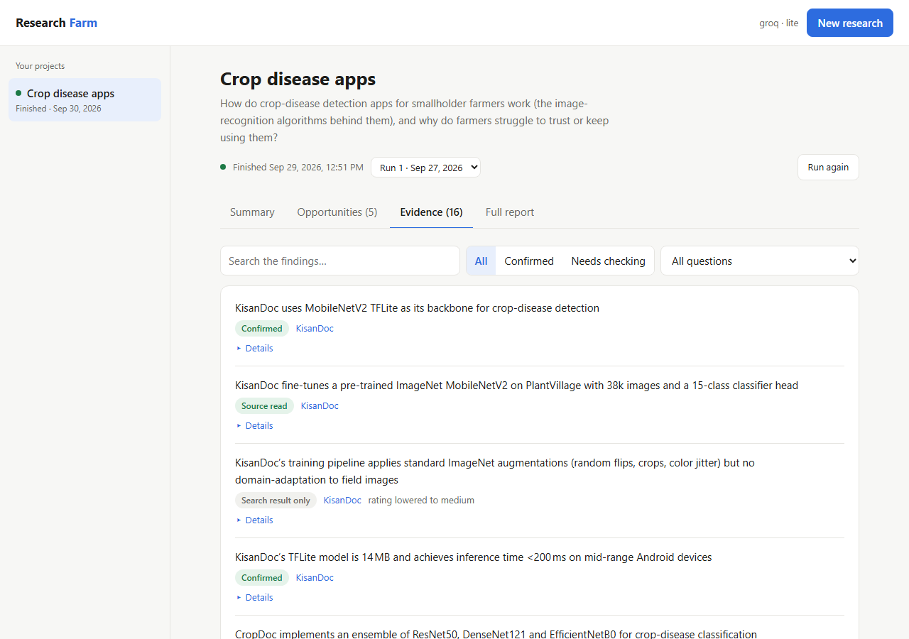

# Farmbt: a multi-agent AI research farm

  

Describe a problem area in plain words. A team of LLM agents researches it on the live web, explains how the existing
approaches work, finds the gaps that are still unsolved, tries to disprove its own conclusions, designs solutions for
the best gap, checks them against existing products and papers, and writes an experiment plan to test the winner.

The main design goal is **reliability with cheap models**. Every step returns validated, structured output, and every
claim is traced to a source the agent actually saw. Key pages are re-read to confirm claims, and conclusions have to
survive a critic agent and a majority vote. The whole pipeline runs on Groq's free tier, and better models plug into
the same structure without code changes.



## Contents

- [What a run produces](#what-a-run-produces)
- [How it works](#how-it-works)
- [Reliability harness](#reliability-harness)
- [Quick start](#quick-start)
- [Providers and profiles](#providers-and-profiles)
- [Command line](#command-line)
- [Dashboard](#dashboard)
- [Configuration](#configuration)
- [Project structure](#project-structure)
- [Testing](#testing)
- [Limitations](#limitations)
- [Roadmap](#roadmap)

## What a run produces

For a mission like *"How do crop-disease detection apps work, and why do smallholder farmers stop using them?"*, a run
produces:

- **A research plan:** distinct questions covering how the technology works, who solves the problem today, user
  pain points, the research frontier and known limitations.
- **Findings:** atomic claims, each with its source URL and an evidence grade (confirmed, read, search result only,
  unchecked or not supported).
- **A map of the field:** the main approaches, how each works, their strengths and weaknesses, and where sources agree
  or contradict each other.
- **Ranked opportunities:** unsolved gaps, why they're still open, what solving them unlocks and ideas to attack them,
  each reviewed by a critic that searched for evidence the gap is already solved.
- **Solutions and an experiment plan** for the best gap: 3–5 options, a prior-art check for each (*already exists*,
  *partly exists* or *looks new*), the recommended option, and a test plan with a hypothesis, baseline, success metric,
  smallest useful test, steps and stop criteria.
- **A Markdown report** in `reports/<project>/`, plus everything stored in SQLite for later runs.



## How it works



Researchers run in parallel and use the provider's server-side web search. Every stage writes its output to SQLite
before the next stage starts, so a run that hits a rate limit, a budget cap or an error resumes exactly where it
stopped without paying for finished work. Monitoring runs (`farm monitor`) read the previous run's gaps and mark each
one `new`, `still_open`, `closing` or `closed`.

## Reliability harness

Small models hallucinate sources, overrate their confidence and return malformed output. Each problem has a specific
countermeasure:

| Problem | Countermeasure |
|---|---|
| One large prompt overwhelms a small model | **Single-purpose agents:** each call does one narrow job |
| Malformed or truncated JSON | **Schema-validated structured output** with retries: first with less reasoning, then in plain JSON mode with the schema in the prompt |
| Invented sources | **Source grounding:** each finding is graded *read*, *seen* or *unverified* by whether its URL appeared in the agent's own tool results |
| Claims a source doesn't support | **Page verification:** the farm downloads the riskiest pages, extracts the passages most relevant to the claims, and a verifier agent checks each claim against the real text |
| A noisy verifier wrongly condemning true claims | **Second opinion:** a claim is only marked *not supported* if a fresh check agrees, the page was complete, and it had enough text (abstract-only, paywalled and JavaScript-only pages are inconclusive) |
| Overconfident ratings | **Confidence caps:** a claim seen only in search results can't be rated above *medium*; an unverified one can't be rated above *low* |
| One-off ideas produced by chance | **Majority voting:** three independent gap-hunting passes, a merger agent groups equivalent gaps, and a gap must appear in most passes to survive |
| Conclusions nobody challenged | **Adversarial critics** for gaps and solutions, which must cite URLs they actually visited |
| Re-inventing something that exists | **Prior-art scout:** searches products, open-source projects, patents and papers before a solution is recommended |
| Rate limits and daily quotas | **Wait-and-retry** on per-minute limits, **switching to another model** when one model's daily quota runs out, and **pausing and resuming** when every model is exhausted |
| Lost work | **Resumable stages** persisted in SQLite |

The same agents run at three sizes ("profiles"), so a frontier model gets more questions, more reading and more gaps
solved, while a free-tier model gets short prompts that fit its token limits.

## Quick start

Requires Python 3.10 or newer.

```bash
git clone https://github.com/Samthnalyst1234/Farmbt.git
cd Farmbt
python -m venv .venv
source .venv/bin/activate          # Windows: .venv\Scripts\activate
pip install -r requirements.txt
```

**Try the whole pipeline offline first.** Mock agents return placeholder data, so this needs no API key and costs
nothing:

```bash
python -m farm research "any topic" --name demo --mock
python -m farm dashboard
```

**Then run real research.** Copy `.env.example` to `.env`, add one provider key (see below) and run:

```bash
python -m farm research "How do fraud-detection models in mobile money work, and where do they fail small merchants?" --name momo-fraud
```

## Providers and profiles

The farm uses the first key it finds in `.env`, or the provider set in `FARM_PROVIDER`.

| Provider | Key | Models | Web search | Notes |
|---|---|---|---|---|
| Anthropic Claude | `ANTHROPIC_API_KEY` | Claude Opus 5 by default | Server-side web search and fetch | Adaptive thinking, per-role effort, automatic refusal fallback |
| Groq | `GROQ_API_KEY` | gpt-oss-120b and gpt-oss-20b | Built-in browser search | Free tier: about 8,000 tokens/minute and 200,000 tokens/day per model |
| xAI Grok | `XAI_API_KEY` | grok-4.7 | Server-side web search | |

The profile is chosen from the provider and model, and `FARM_PROFILE` overrides it:

| Profile | Used for | Questions | Findings kept per question | Pages re-checked | Gap votes | Gaps solved |
|---|---|---|---|---|---|---|
| `lite` | Groq free tier, small models | 3 | 8 | 4 | 3 | 1 |
| `standard` | Mid-size paid models | 5 | 20 | 12 | 3 | 1 |
| `deep` | Claude Opus, Fable | 7 | 40 | 30 | 3 | 2 |

On Groq's free tier, expect roughly one small run per day. The farm pauses when the daily allowance is used up and
`python -m farm resume <run>` continues it the next day.

## Command line

```bash
python -m farm research "<mission>" [--name NAME]   # start a project and run it
python -m farm monitor NAME                         # research again: what changed, which gaps are still open
python -m farm resume RUN_ID                        # continue a paused or failed run
python -m farm solve NAME [--gap G2] [--redo]       # design solutions for a gap in the latest run
python -m farm gaps NAME                            # ranked gaps from the latest run
python -m farm list                                 # all projects
python -m farm dashboard [--port 8765]              # web dashboard
```

`research`, `monitor`, `resume` and `solve` accept `--questions N`, `--workers N`, `--solve N` (gaps to solve, 0 to
skip), `--max-cost USD` (the session stops and saves when it reaches this) and `--mock`.

## Dashboard

`python -m farm dashboard` opens a local web app at `http://127.0.0.1:8765`:

- **Summary:** the problem, the top opportunities, the recommended next step and how far you can trust the evidence.
- **Opportunities:** each gap with the critic's review, its solutions, the prior-art check and the experiment plan.
- **Evidence:** every finding with its source and evidence grade, searchable and filterable.
- **Full report:** the rendered Markdown brief.

You can start new research, re-run a project, continue a paused run or design solutions for any gap from the page. A
progress bar shows which step is running. The server only listens on `127.0.0.1`, validates every request before it
becomes a command, and runs one job at a time.



## Configuration

All settings are environment variables, which you can also put in `.env`.

| Variable | Default | Purpose |
|---|---|---|
| `FARM_PROVIDER` | First key found | `claude`, `groq` or `grok` |
| `FARM_MODEL` | Depends on provider | Model for every agent |
| `FARM_MODEL_<ROLE>` | | Model for one role, e.g. `FARM_MODEL_RESEARCHER=claude-sonnet-5` |
| `FARM_EFFORT_<ROLE>` | Per role | Reasoning effort for one role (`low` to `max`) |
| `FARM_PROFILE` | Automatic | `lite`, `standard` or `deep` |
| `FARM_QUESTIONS`, `FARM_WORKERS`, `FARM_SOLVE` | From profile | Run size |
| `FARM_GAP_VOTES` | 3 | Independent gap-hunting passes; 1 turns voting off |
| `FARM_VERIFY_PAGES` | From profile | Source pages to re-read per run; 0 turns page checks off |
| `FARM_MAX_COST` | 5 | USD per session before the run pauses; 0 for no limit |
| `FARM_DB`, `FARM_REPORTS` | `farm.db`, `reports` | Storage locations |

Roles are `planner`, `researcher`, `extractor`, `verifier`, `analyst`, `gap_hunter`, `gap_merger`, `critic`,
`solution_designer`, `prior_art`, `solution_critic`, `experiment_planner` and `reporter`.

## Project structure

```
farm/
  __main__.py      command line
  orchestrator.py  stages, parallel research, grounding, verification, voting, solver, ranking, reports
  prompts.py       each agent's instructions and JSON output schema
  llm.py           provider clients (Claude, Groq, xAI), rate-limit handling, model fallback, spend meter, mock mode
  pages.py         page download, HTML to text, relevant-passage extraction
  store.py         SQLite persistence: projects, runs, stage outputs, findings, gaps
  config.py        providers, profiles, per-role models and effort, prices
  dashboard.py     local web server and job runner
  web/index.html   dashboard front end (plain JavaScript, no build step)
tests/             pytest suite (offline, no API keys)
docs/images/       screenshots
```

## Testing

```bash
pip install -r requirements-dev.txt
pytest
```

The 28 tests run offline in about 15 seconds. They cover:

- **The whole pipeline end to end** with mock agents, including pausing on the budget limit and resuming without
  redoing finished stages.
- **Source grading, confidence caps and majority voting.**
- **HTML-to-text extraction and relevant-passage selection.**
- **Groq citation parsing, rate-limit header parsing and model fallback** when a daily quota runs out.
- **Validation of every dashboard request** before it becomes a command.

## Limitations

- **Small models miss things.** On the free tier, research is shallow (3 questions, a few searches each) and can miss
  major players in a field. Stronger models with the `deep` profile search and read far more.
- **The critic can over-correct.** It sometimes treats a single research paper as proof that a gap is "already solved",
  when the problem is really still being worked on.
- **Page checks can't read everything.** Paywalled, JavaScript-only and PDF pages come out inconclusive.
- **Voting is less independent on monitoring runs,** because every pass sees the previous run's gaps.
- **Plans are proposals, not results.** The farm proposes and plans experiments; it doesn't run them. Its time and
  cost estimates come from the model and need a sanity check.
- **Only the Groq path has run against a live API.** The Claude and xAI paths are written against their official SDKs
  but haven't yet been tested against the live services.

## Roadmap

- Separate "already solved" from "being worked on" in the critic's verdict, and require a written reason.
- More providers: DeepSeek, OpenRouter, and local models through Ollama or llama.cpp.
- A pluggable search API for providers without built-in web search.
- A builder agent that turns an experiment plan into runnable code.
- Scheduled monitoring with change alerts.

## Acknowledgements

Built with [Claude Code](https://claude.com/claude-code) as a pair programmer.

## License

[MIT](LICENSE)
